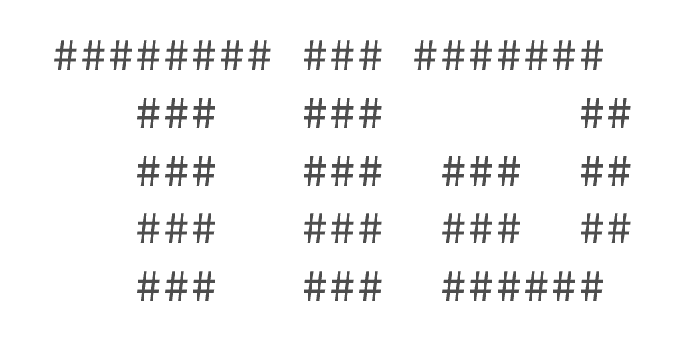

<p align="center">
    <br>
    <a href="https://goreportcard.com/report/github.com/SeerUK/tid">
        
    </a>
    <a href="https://github.com/SeerUK/tid/releases">
        
    </a>
</p>

A simple, CLI-based, personal time tracking utility. `tid` uses [Bolt][1] as a storage backend, and 
does not require an active daemon to run.

## Installation

```
$ go get -u -v github.com/SeerUK/tid/...
```

## Usage

Full usage information can be seen by using the built-in contextual help. This can accessed by
running:

```
$ tid --help
$ # Or for command help:
$ tid start --help
```

Tid has sub-commands in some places, for example:

```
$ tid entry create 1h10m "Resolving live issue"
```

And also has short aliases for some commands:

```
$ tid e c 1h10m "Resolving live isssue"
```

Here's some simple general usage:

```
$ tid start "Working on AI"
Started timer for 'Working on AI' (fdb6f0d)

$ tid status
+------------+---------+------------+------------+---------------+----------+---------+
|    DATE    |  HASH   |  CREATED   |  UPDATED   |      NOTE     | DURATION | RUNNING |
+------------+---------+------------+------------+---------------+----------+---------+
| 2017-03-01 | fdb6f0d | 10:41:34AM | 10:41:34AM | Working on AI | 5s       | true    |
+------------+---------+------------+------------+---------------+----------+---------+

$ tid stop
Stopped timer for 'Working on AI' (fdb6f0d)

# Gone for lunch...

$ tid resume
Resumed timer for 'Working on AI' (fdb6f0d)

# Forgot to add this!

$ tid entry create 15m "Afternoon nap"
Created entry 'Afternoon nap' (3d77f69)

$ tid report
Report for 2017-03-01.

Total Duration: 2h34m37s
Entry Count: 1

+------------+---------+------------+-----------+-----------------+----------+---------+
|    DATE    |  HASH   |  CREATED   |  UPDATED  |      NOTE       | DURATION | RUNNING |
+------------+---------+------------+-----------+-----------------+----------+---------+
| 2017-03-01 | fdb6f0d | 10:41:34AM | 1:01:03PM | Working on AI   | 2h19m37s | true    |
+            +---------+------------+-----------+-----------------+----------+---------+
|            | 3d77f69 | 1:26:30PM  | 1:26:30PM | Afternoon nap   | 15m0s    | false   |
+------------+---------+------------+-----------+-----------------+----------+---------+
```

### Starting an Entry Timer `start`

```
$ tid start "A note"
```

The note is required, but can by any string value. It's used so when you view the status or the
report you know what you've been tracking. Try make it something identifiable. Maybe this will just
be an issue ID from your issue tracker?

### Stopping an Entry Timer `stop`

```
$ tid stop
```

Stop always stops the currently active timer, if you don't have an active timer, it won't do
anything.

### Resuming an Entry Timer `resume|res`

```
$ tid resume
$ tid resume fdb6f0d
```

The resume command allows you to resume the most recently stopped entry, or a specific entry by
passing in that entry's hash. If you don't have a most recently stopped entry then you would have to
pass in an entry hash to use resume (e.g. if you remove the entry being tracked).

### Status of an Entry `status|st`

```
$ tid status
$ tid status fdb6f0d
$ tid status --format="{{.Duration}} on '{{.Note}}'"
```

You can view the status of the currently tracked entry (the most recently started or resumed entry)
or you can view the status of a specific entry. The output is similar to the report output.

The `--format` option uses Go's `text/template` package, and is passed an [Entry][entry].

### Report your Timesheet `report|rep`

```
$ tid report
$ tid report --start=2017-02-01 --end=2017-02-28
$ tid report --start=(tiddate --months=-6)
$ tid report --no-summary
$ tid report --format="{{.Hash}} {{.Note}}" --no-summary
```

The report command is quite powerful and gives you a lot of different ways to view timesheet data.
By default the output will display a summary, and a table of the entries. You can control the output
by passing other options like `--format` which is useful for scripting.

The `--format` option uses Go's `text/template` package, and is passed an [Entry][entry].

### Management Commands

#### Entries `entry|e`

Sometimes you just forget to track something, and maybe it was a couple of days ago! Or maybe you
realised you've tracked some additional time by mistake. The entry management commands let you
create new entries on the fly, or manage existing ones. There's also a listing that's similar to the
report view, but without the summary.

##### Create `create|c`

```
$ tid entry create <DURATION> <NOTE>
$ tid entry create 10m "Hello, World"
$ tid e c 10m "Hello, World"
```

##### Delete `delete|d`

```
$ tid entry delete <HASH>
$ tid entry delete c24543c
$ tid e d c24543c
```

##### List `list|ls`

```
$ tid entry list [OPTIONS]
$ tid entry list --start=(tiddate --days=-7) --end=(tiddate) --format="{{.Hash}}"
$ tid entry list --date=(tiddate --days=-7)
$ tid e ls --date=(tiddate --days=-7)
```

The `--format` option uses Go's `text/template` package, and is passed an [Entry][entry].

##### Update `update|u`

```
$ tid entry update <HASH> [OPTIONS]
$ tid entry update c24543c --duration=10m --note="More CMS work..."
$ tid entry update c24543c --offset=-2m12s
$ tid e u c24543c --offset=-2m12s
```

The `--duration` and `--offset` options are mutually exclusive. Offset accepts negative values for
updating the duration by the amount given.

#### Timesheets

##### Delete `delete|d`

```
$ tid timesheet delete <DATE>
$ tid timesheet delete 2017-04-10
$ tid t d 2017-04-10
```

##### List `list|ls`

```
$ tid timesheet list [OPTIONS]
$ tid timesheet list --start=(tiddate --days=-7) --end=(tiddate) --format="{{.Hash}}"
$ tid timesheet list --date=(tiddate --days=-7)
$ tid t ls --date=(tiddate --days=-7)
```

The `--format` option uses Go's `text/template` package, and is passed an [Timesheet][timesheet].

#### Workspaces

Workspaces are separate time-tracking environments designed to segregate unrelated work. You can
choose what that means, but one example could be tracking time for personal projects separately to
work projects.

##### Create `create|c`

```
$ tid workspace create <NAME>
$ tid workspace create freelance
$ tid w c freelance
```

##### Delete `delete|d`

```
$ tid workspace delete <NAME>
$ tid workspace delete freelance
$ tid w d freelance
```

Deleting a workspace will remove all timesheets and entries within it. There's no recovery from this
unless you've backed up your database.

##### List `list|ls`

```
$ tid workspace list
$ tid w ls
```

The active workspace will be denoted with an asterisk (e.g. `default *`).

##### Switch `switch|s`

```
$ tid workspace switch <NAME>
$ tid workspace switch freelance
$ tid w s freelance
```

Switching workspace will first stop any running timers, meaning you don't have to worry about time
wracking up because you've forgotten to stop then switch!

## Extras

### Completions

Completions are provided for Bash and Fish and are located with obvious names in the `extras/completions/`
directory.

### BitBar

A [BitBar](https://github.com/matryer/bitbar) plugin is available (with installation instructions) in the 
`extras/bitbar` directory.

## License

MIT

[1]: https://github.com/boltdb/bolt

[entry]: pkg/types/entry.go#L19
[timesheet]: pkg/types/timesheet.go#L13
